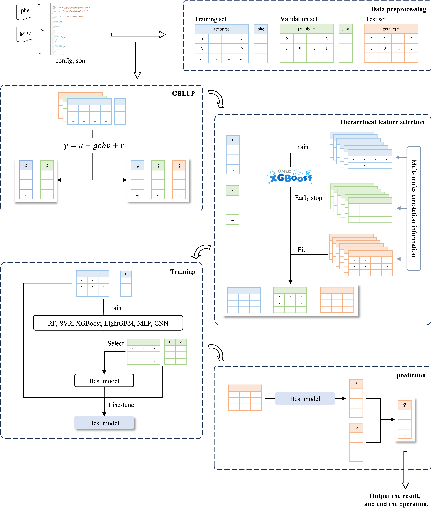

# MARS
integrating Multi-omics Annotation into Residual Split indirect deep learning model for efficient and robust genomic prediction.🚀

## About

MARS is a PyTorch-based framework for genomic prediction (GP), featuring implementations of:
* two-step strategy which machieves segmented modeling of linear and nonlinear, additive and interaction effects
* hierarchical feature selection strategy
* various non-linear models with customizable parameters



### Motivation

MARS integrates the two-step strategy and hierarchical feature selection.
 MARS offers a modular and user-friendly workflow for GP.
 It is easy to set parameters, and to configure the model, and to train and test.

## Installation
MARS can be installed by using the following code:
```sh
git clone https://github.com/jnanma/MARS.git
pip install ./MARS
``` 

## Getting started guide

To help you get started, we provide a ```config_template.json``` config file where supported attributes, their meaning and possible values are explained. 
 All the hyperparameters of the training procedure: i.e. data location, model defintion, training hyperparametrs etc. are controlled by the ```config.json``` file. 
 Organize and input phenotype and genotype files according to the requirements in the temporary file.
  
  
To train and predict, run 
```sh
python main.py --json_path config
```  
The ```json_path``` specifies the directory containing the configuration file, not the file itself. The configuration file must be named ```config.json```.  

Ex: use demo to run MARS:
```sh
python ./MARS/mars/main.py --json_path ./MARS/mars/demo
```  
  
  
A ```main.py``` code file includes 5 modules:   
 * data preprocessing
 * GBLUP prediction
 * hierarchical feature selection
 * model training
 * final prediction


## Note
Before running MARS, it is necessary to download the [```HIBLUP```](https://www.hiblup.com/)  software .
# MARS
